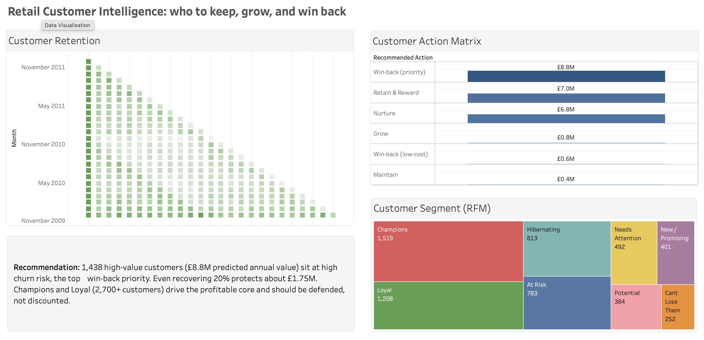

# Retail Customer Intelligence

A SQL-first customer analytics project on the Online Retail II dataset. It takes
~1M raw e-commerce transactions and works out the thing a retention team actually
needs to know: **which customers to keep, which to grow, and which to win back
before they're gone**, with the revenue at stake attached to each.

**▶️ [View the live, interactive dashboard on Tableau Public](https://public.tableau.com/app/profile/jahnavi.reddy7024/viz/RetailCustomerIntelligence/RetailCustomerIntellegence)**

[](https://public.tableau.com/app/profile/jahnavi.reddy7024/viz/RetailCustomerIntelligence/RetailCustomerIntellegence)


## Why I built it this way

Most RFM projects stop at "here are your segments." That's never been enough in
practice, a segment isn't an action. So the centre of this project is a
**Customer Action Matrix**: every customer gets a recommended next step
(Win-back, Retain, Grow, Nurture, Maintain) derived from three signals together,
not one. A customer only lands in *Win-back (priority)* if they're **both**
high-value and high-churn-risk, which no single RFM score can tell you.

I did the analytics in SQL rather than pandas. Recency,
frequency, monetary scoring, the cohort retention matrix, lifetime value; all of
it is window functions and CTEs in dbt on Snowflake. Python only shows up for the churn model.

## What it found

- **1,438 high-value customers, about £8.8M of predicted annual value are at
  high churn risk.** They're the single clearest place to spend retention budget.
  Recover even 20% and you protect roughly £1.75M.
- **Champions and Loyal customers (2,700+) drive the profitable core.** They
  should be defended, not discounted, a common trap is throwing promotions at
  people who'd have bought anyway.
- Retention drops hard after month one (the first cohort held at around 35% at month 1),
  then stabilises, typical for retail, and it tells you the first 30 days are
  where onboarding effort pays off.

## How it's built

```
raw.online_retail (Snowflake, 1.07M rows)
      │  dbt (SQL)
   staging      cleaned to ~820k rows (see "Data decisions" below)
      │
 intermediate   orders, and customer purchase sequencing via window functions
      │
   marts
     ├─ mart_rfm                 NTILE(5) recency/frequency/monetary → 8 segments
     ├─ mart_cohort_retention    retention matrix, pure SQL
     ├─ mart_clv                 lifetime value
     └─ mart_customer_actions    RFM + CLV + churn → one action per customer
      │
   churn_model.py                logistic regression → churn probability
      │  (fed back in as a dbt seed)
   Tableau Public                action matrix, cohort heatmap, segment treemap
```

**Stack:** Snowflake · dbt Core · SQL (window functions, CTEs) · Python
(scikit-learn) · Tableau Public.

## Data decisions 

The Online Retail II data is messy, and how you clean it changes every number
downstream. I made these calls on purpose:

- **Dropped ~23% of rows, mostly guest checkouts with no customer ID.** You
  can't do customer-level analysis on customers you can't identify. Worth stating
  plainly rather than quietly filtering.
- **Removed non-product lines** (postage, bank charges, manual adjustments, test
  codes) so they don't inflate revenue.
- **CLV needed two guards.** My first pass produced a customer with a predicted
  CLV of £3M off 6 orders, because all six fell within a single day, so the
  annualised frequency exploded. I floored lifespan at 30 days and capped
  frequency at 52/year (once a week). Both are documented in the model.

## The churn model

The first version scored 99% accuracy. That's a red flag, not a win, it was
**target leakage**. I'd defined churn as `recency > 90 days` and then handed
recency to the model as a feature, so it was just reading the label off an input.
I removed recency and the score dropped to a realistic **~0.70 ROC-AUC**, with
**frequency** as the strongest driver (frequent buyers churn less, which is both
true and reassuring). A believable model I can explain beats a perfect one I
can't.

## Limitations

CLV here is a simple AOV × frequency proxy; a probabilistic model (BG/NBD +
Gamma-Gamma) would refine the predictions. And the dataset is a wholesaler, so
the top CLV tier is skewed by a few bulk B2B buyers rather than loyal regulars, 
I call that out rather than hide it, because it changes how you'd read the
segment.
